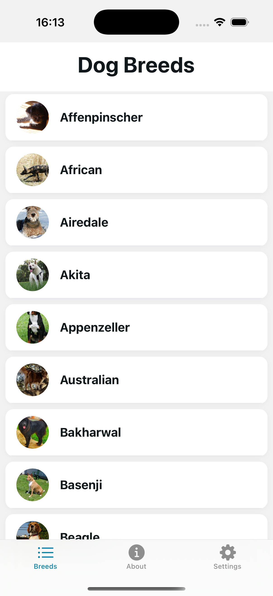

# AI Hands-On Report

## 1. App Concept (Generated with AI)

**Concept:**
Dog Breed Explorer — a mobile app to browse, search, and view images of dog breeds using the [Dog CEO API](https://dog.ceo/dog-api/).

**Generated by AI:**

- [x] Used AI to brainstorm 3 app ideas based on the Dog API.
- [x] Selected the "Dog Breed Explorer" concept for its clarity and extensibility.

## 2. Acceptance Criteria (Generated with AI)

- [x] User sees a list of all dog breeds.
- [x] User can tap a breed to view a gallery of images for that breed.
- [x] User can refresh the gallery to see new images.
- [x] App shows loading and error states.
- [x] User can switch between light/dark/system theme in Settings.

## 3. Architecture & Navigation (Generated with AI)

- [x] Tab navigation: Breeds | About | Settings
- [x] Stack navigation inside Breeds: List → Gallery
- [x] Theming via ThemeContext, supports system and manual mode
- [x] Data layer: DogApi service (fetches breeds & images)

## 4. AI-Assisted Coding

- [x] Used AI to generate:
  - [x] Service for API requests (DogApi.ts)
  - [x] List and gallery screens (with FlatList, error/loading states)
  - [x] ThemeContext and theme switcher logic
  - [x] Unit tests for API service
- [x] Used AI for code review questions and suggestions

## 5. Code Optimization (with AI)

- [x] Added pull-to-refresh to gallery screen (AI suggested best UX pattern)
- [x] Refactored color usage to use theme everywhere (AI audit)
- [x] Used AI to suggest context-based theming for instant switching

## 6. AI as Code Reviewer

**Questions asked:**

- [x] Are there edge cases in BreedGalleryScreen?
- [x] Is the use of hooks optimal?
- [x] How to make theming scalable?
      **AI feedback:**
- [x] Suggested to handle empty image arrays
- [x] Recommended context for theming
- [x] Advised to use theme colors for all UI elements

## 7. Unit/Widget Testing (Generated with AI)

- [x] Wrote Jest tests for DogApi service (success & error cases)
- [x] Used AI to generate test cases and structure

## 8. Screenshots & Demo

### Main Screenshots

- **Breeds List (Light):**
  
- **Breed Gallery:**
  
- **Settings (Theme Switcher):**
  
- **About Screen:**
  
- **Error State:**
  
- **Dark Mode Example:**
  

### Demo Video

- [ ] (Optional) Add link to demo video here

## 9. Reflection

- [x] AI greatly accelerated prototyping and code review
- [x] Theming and navigation became much easier with AI-generated patterns
- [x] Testing and error handling improved via AI suggestions

---

**Author:** Bykau Vadzim
**Date:** 2024-06-23
