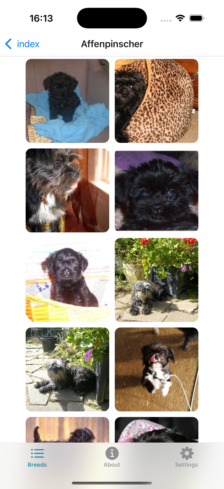
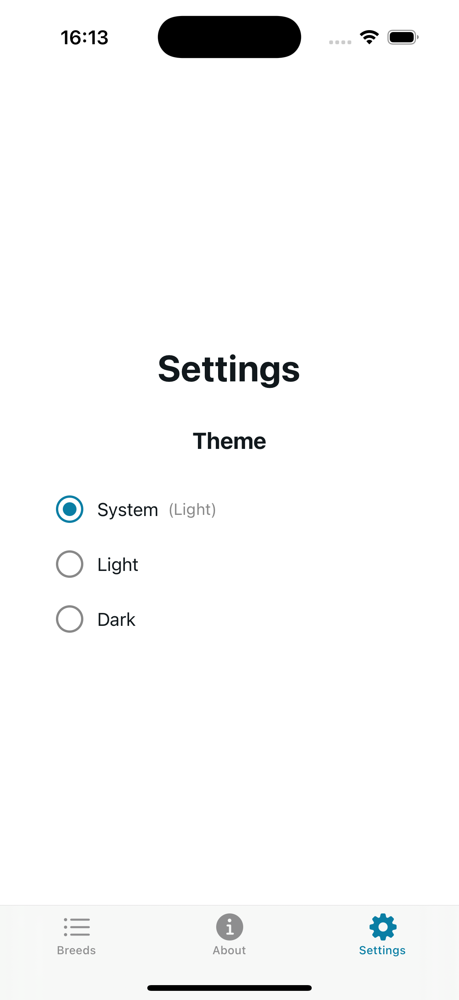
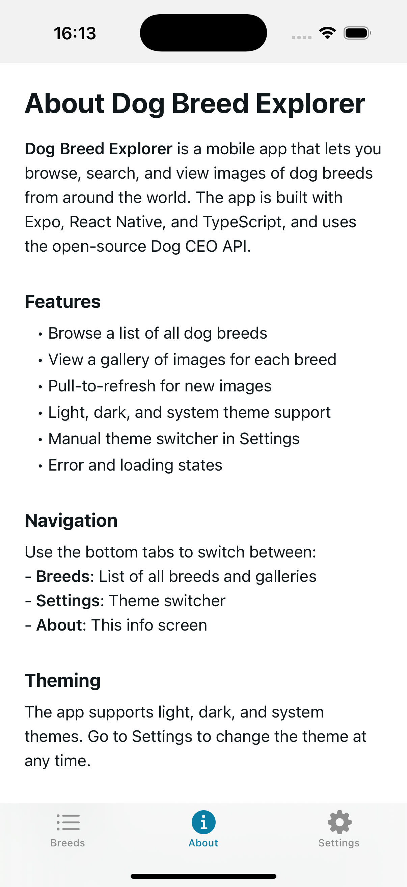
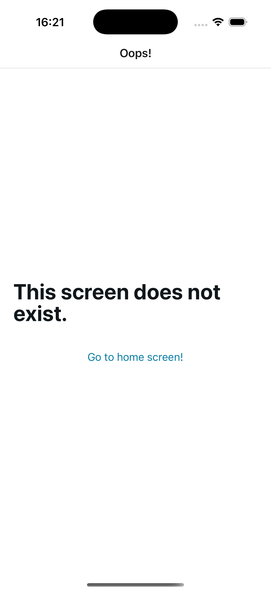
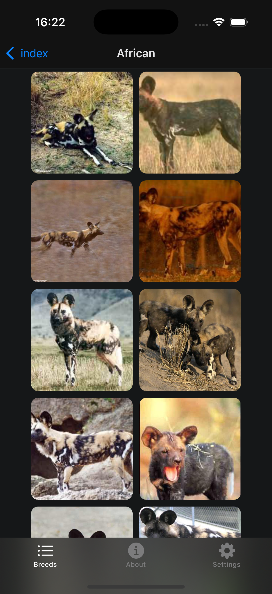

# Dog Breed Explorer

A mobile app to browse, search, and view images of dog breeds using the [Dog CEO API](https://dog.ceo/dog-api/). Built with Expo, React Native, and TypeScript.

## Screenshots

> Place your screenshots in the `screenshots/` directory in the project root.

|                Breeds List (Light)                |               Breed Gallery               |               Settings                |
| :-----------------------------------------------: | :---------------------------------------: | :-----------------------------------: |
|  |  |  |

|          About Screen           |           Error State           |                  Dark Mode                  |
| :-----------------------------: | :-----------------------------: | :-----------------------------------------: |
|  |  |  |

## Demo Video

[▶️ Watch demo video](screenshots/video.mp4)

<video src="screenshots/video.mp4" controls width="400"></video>

## Features

- Browse a list of all dog breeds
- View a gallery of images for each breed
- Pull-to-refresh for new images
- Light, dark, and system theme support
- Manual theme switcher in Settings
- Error and loading states
- About screen with app info

## Getting Started

### Prerequisites

- [Node.js](https://nodejs.org/)
- [Expo CLI](https://docs.expo.dev/get-started/installation/)

### Installation

```sh
# Clone the repo
git clone https://github.com/Vadim-Bykov/ai-homework.git
cd ai-homework

# Install dependencies
npm install
```

### Running the App

```sh
# Start Expo
npx expo start
# Scan the QR code with Expo Go (iOS/Android)
```

## Project Structure

```
ai-homework/
  app/
    (tabs)/
      breeds/         # Breeds list and gallery screens
      explore.tsx     # About screen
      settings.tsx    # Settings screen (theme switcher)
    _layout.tsx       # Root navigation
  components/         # UI components and ThemeContext
  constants/          # Theme colors
  services/           # API service (DogApi.ts)
  hooks/              # Theming hooks
  tests/              # Unit tests
  AI-Hands-On-Report.md
  README.md
```

## AI Usage

- App concept, acceptance criteria, and architecture generated with AI
- Business logic, theming, and navigation code written with AI assistance
- Code review and optimization suggestions from AI
- Unit tests generated by AI
- See [AI-Hands-On-Report.md](./AI-Hands-On-Report.md) for details

## Technologies

- [Expo](https://expo.dev/)
- [React Native](https://reactnative.dev/)
- [TypeScript](https://www.typescriptlang.org/)
- [Dog CEO API](https://dog.ceo/dog-api/)
- [@react-native-async-storage/async-storage](https://react-native-async-storage.github.io/async-storage/)
- [Jest](https://jestjs.io/) (testing)

## Author

Bykau Vadzim

---

Feel free to open issues or contribute!
